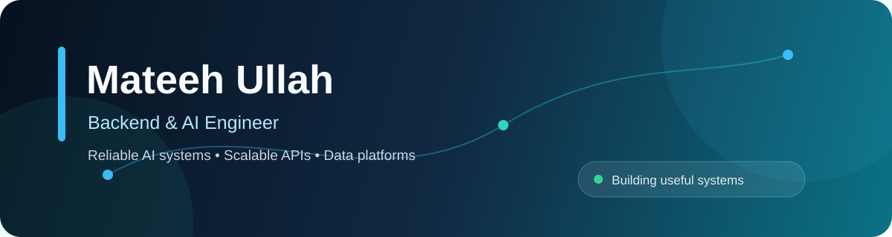

  

  
  
  

## About me

I build reliable AI products, backend services, data pipelines, and modern web applications. My main interests are **agentic AI, LLM evaluation, RAG, MCP, Python backends, and cloud-native systems**.

- Building agent workflows, RAG pipelines, model evaluation, and AI integrations
- Developing APIs, authentication, background jobs, and distributed services
- Working with ETL pipelines, analytics workflows, and relational and document databases
- Shipping with Docker, Kubernetes, cloud platforms, automated testing, and CI/CD

## Core strengths

<table>
  <tr>
    <td width="50%" valign="top">
      <h3>AI & LLM Systems</h3>
      LLM applications, agent workflows, RAG pipelines, model evaluation, and AI integrations.
    </td>
    <td width="50%" valign="top">
      <h3>Backend Engineering</h3>
      FastAPI, Django, Flask, Node.js, NestJS, REST APIs, authentication, and background jobs.
    </td>
  </tr>
  <tr>
    <td width="50%" valign="top">
      <h3>Data Systems</h3>
      ETL pipelines, PostgreSQL, MySQL, MongoDB, Redis, Pandas, and analytics workflows.
    </td>
    <td width="50%" valign="top">
      <h3>Cloud & Delivery</h3>
      Docker, Kubernetes, AWS, GCP, GitHub Actions, CI/CD, and serverless services.
    </td>
  </tr>
</table>

## Selected engineering work

| Project | What it demonstrates |
|---|---|
| [**SereniMind**](https://github.com/MateehUllah/SereniMind) | AI-powered conversational application with React, FastAPI, authentication, and persistent chat history. |
| [**Automated Root Cause Analysis**](https://github.com/MateehUllah/Automated-Root-Cause-Analysis) | Applied AI for identifying system failures and explaining their likely causes. |
| [**AI Connectivity: Healthcare & Education**](https://github.com/MateehUllah/ai-connectivity-healthcare-education) | ML and LLM work that uses real-world data to identify infrastructure gaps and generate recommendations. |
| [**Backend Coach — AI Hackathons**](https://github.com/MateehUllah/backend_coach-ai-hackathons) | Backend engineering work for AI-focused hackathon workflows. |

## Technology stack

  
  
  
  
  
  
  
  
  
  
  
  
  

## Open source

I focus on useful contributions to **AI infrastructure, developer tools, Python and backend projects, and data engineering**.

- Merged into [**django-ledger #191**](https://github.com/arrobalytics/django-ledger/pull/191): added a Docker development setup, Docker Compose workflow, entrypoint, and setup documentation.
- View [**all pull requests authored by MateehUllah**](https://github.com/pulls?q=is%3Apr+author%3AMateehUllah).

## How I work

- Understand the problem and existing code before changing it
- Keep changes focused and easy to review
- Verify with tests, linting, type checks, and a final self-review
- Respond clearly to feedback and improve the solution

  <strong>Building reliable software, useful AI systems, and better developer workflows.</strong>

